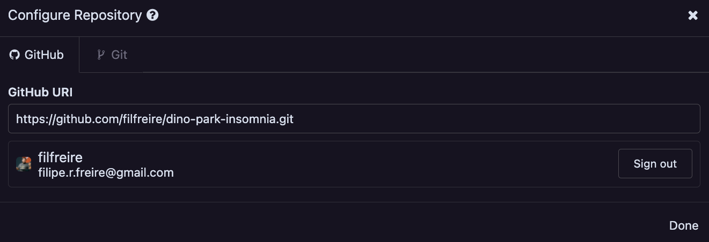
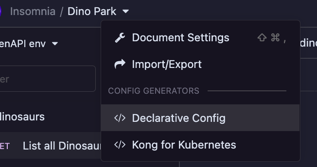

# dino-park-insomnia

Sandbox/experiment repository to try out [Insomnia](https://insomnia.rest)'s Git Sync features.

## Prerequisites

- [Docker](https://docs.docker.com/engine/install/)
- [DecK](https://github.com/Kong/deck) (for Kong Configuration management)
- [Insomnia](https://github.com/Kong/insomnia/releases) (use version `2022.3.0-beta.4` and up)

## Setup

Run Kong Gateway (and needed containers):

```bash
make build
```

Apply configuration to Kong Gateway:

```bash
deck sync -s kong.json
```

> To clean up containers run `make clean`

## Run

- Import this repository on Insomnia via Git (link to repo is: `https://github.com/filfreire/dino-park-insomnia.git`)



- If you make changes to the Spec, you can re-run on Insomnia the Declarative config generation (see image bellow), and edit the contents of [kong.json](kong.json) file with the output. Don't forget to re-apply it to your Kong gateway instance by running `deck sync -s kong.json`.



## Other

### Troubleshooting

- To check connection between [DecK](https://github.com/Kong/deck) and your local Kong instance: `deck ping`

### Useful documentation

- [Installing and running Kong Gateway OSS using Docker](https://docs.konghq.com/gateway/latest/install-and-run/docker/);
### Gitlab Example:

- Spin up Gitlab Docker container: `docker-compose -f gitlab/docker-compose.yml up`
- Get the `root` username password: `sudo docker exec -it gitlab_web_1 grep 'Password:' /etc/gitlab/initial_root_password`
- Login to the Gitlab Docker container
- Setup a personal access token (see [this link](https://docs.gitlab.com/ee/user/profile/personal_access_tokens.html) on how to do it)
- Create a blank repo, and import it to Insomnia (e.g. `http://localhost/root/example-repo.git`)
